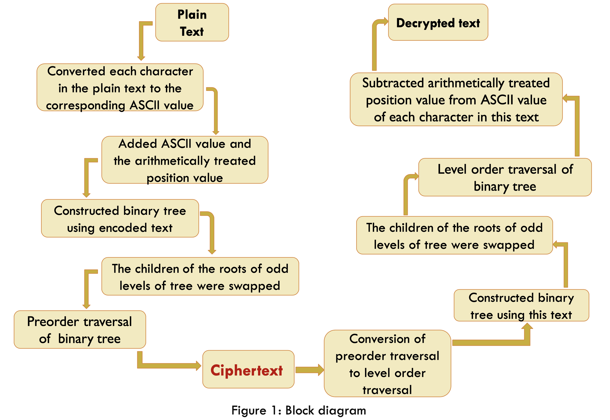
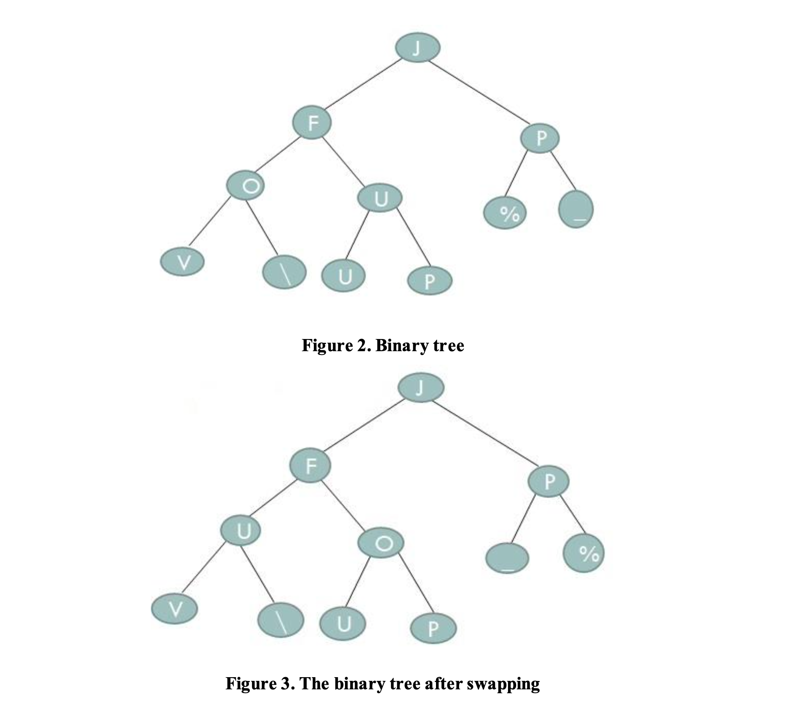
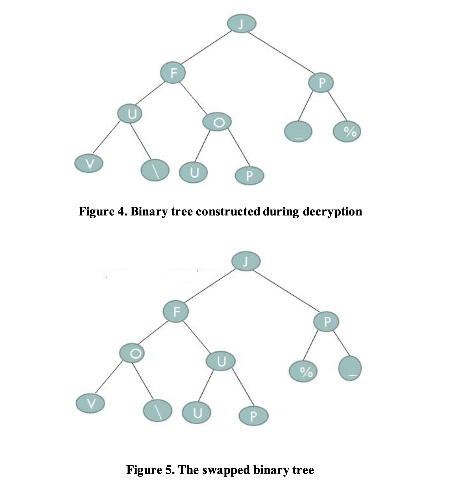

## DATA ENCRYPTION USING BINARY TREE

### INTRODUCTION
Since the world has become predominantly digital, the need for data security is at the peak and
hence efforts are being continued both in the academic and industrial levels to enhance data security measures. Cryptography basically, deals with the development and analysis of protocols
for secure communication. It helps in preventing malicious third parties from retrieving
information shared between two entities. Data Confidentiality, Data Integrity, Authentication and Non-repudiation are core principles of modern-day cryptography.

The sender’s message or the Plaintext, is converted into an unreadable form using a Key k and the
text obtained is called the Ciphertext. This process is known as Encryption. At the time of receival, the Ciphertext is converted back into the plaintext using the same Key k, so that it can be read by
the receiver. This process is known as Decryption. A cryptographic algorithm is mathematical functions to perform encryption and decryption of the original data and it works in combination with a secret key consisting of alphabets, numbers, special characters, words, phrases etc.

### METHODOLOGY

Encryption was performed in two stages and the steps involved are shown in Figure 1.

 

#### Encryption - Stage 1
In the first stage, the ASCII value of each character in the text to be encoded (plain text) was added to its arithmetically treated position value (index).

The ASCII value corresponding to each character in the plaintext is subjected to the following
arithmetical operation:

[(ASCII value-32) + Position – 1]%95 + 32 ... for even position [(ASCII value-32) + Position + 1]%95 + 32 ... for odd position

To demonstrate this, the plain text (message) to be encrypted was taken as _HELLO WORLD_

The position values of the characters and the string obtained after the arithmetical operation are given below:

Plaintext: HELLO WORLD  
Position value(index): 1 2 3 4 5 6 7 8 9 10 11  
String after 1st stage: J F P OU % _ V \ U P

#### Encryption - Stage 2
In the second stage, the binary tree was constructed using the encoded text (Figure 2). The children
of the roots of odd levels of the tree were then swapped (Figure 3) and the ciphertext (coded message) was generated by preorder traversal of the binary tree.

 

So, the encrypted text (cipher text) obtained was ‘JFUV\OUPP_%’

#### Decryption - Stage 1
Decryption was performed as follows: In the first stage the cipher text was subjected to level order traversal and the binary tree was constructed using this (Figure 4). The children of the roots of odd
levels of the tree were interchanged (Figure 5) followed by level order traversal of the binary tree.

Cypher text: JFUV\OUPP_%

Text after preorder to level order traversal: JFPUO_%V\UP

Therefore, the text obtained after level order traversal was ‘JFPOU%_V\UP’

#### Decryption - Stage 2
In the second stage, the ASCII value of each character in the above encoded text was subtracted from its arithmetically treated position value to get the decrypted original plain text.

The ASCII values of the characters in the are subjected to the following arithmetical operation:

[(ASCII value-32) - Position – 1 + 20*95]%95 + 32 ...for even position

[(ASCII value-32) - Position + 1 + 20*95]%95 + 32 ...for odd position 

Encodedtext: JFPOU%_V \ U P

Position: 1 2 3 4 5 6 7 8 9 10 11 

Decrypted text: HELLO WORLD

 

The time complexity was O(n) for encryption as well as decryption.
